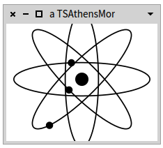

# Roassal3
[](https://travis-ci.org/ObjectProfile/Roassal3)

Roassal3 is a new agile visualization engine for Pharo 8 and Pharo 9. Roassal is made to visualize data in an interactive way data. 


## Installation on Pharo
Execute the following incantation in a Playground:
```Smalltalk
Metacello new
    baseline: 'Roassal3';
    repository: 'github://ObjectProfile/Roassal3';
    load.
``` 

Once loaded, you can execute in a playground:

```Smalltalk
RSChartExample new example01Markers open
```

You should see:


Another example of chart may be seen using:
```Smalltalk
RSChartExample new example11BarplotCombinedWithLine open
```

You should see:


Visualization of a complex graph:
```Smalltalk
RSShapeExamples new example25BisBimetricLineOnLargeExample open
```


An example of animation may be seen using:

```Smalltalk
RSAnimationExamples new example06Atom open
```
You should see an animated version of:



## Tutoriales

Here is a series of tutoriales. New tutoriales are regularly added.

[Tutorial 01 - Adding Simple Nodes, Edges, and Layout](LesMiserables.md)

[Tutorial 02 - Graph Manipulation](GraphTutorial.md)

[Tutorial 03 - Inspector Integration](GTInspectorIntegration.md)

[Tutorial 04 - Shape Composition](ShapeComposition.md)

## Documentation
A major effort on writing documentation is under construction. The wiki pages is currently the main source of documentation for Roassal3: https://github.com/ObjectProfile/Roassal3/wiki


## Roassal3 as a dependent application
If you wish to set a dependency to Roassal3 in your application, you simply need to add in your baseline:

```Smalltalk
spec baseline: 'Roassal3' with: [ spec repository: 'github://ObjectProfile/Roassal3/src' ].
```
_____
## Get in touch
Share your happiness by joining the #Roassal channel, in the Pharo discord server: https://pharo.org/community

_____
## Acknowledgement

Roassal3 is a community effort, and we are really grateful to a number of people. In no particular order, big thanks to:
Stéphane Ducasse, Martin Días

_____
## Developers section
If you are a regular contributor of Roassal3, you probably wish to have a local clone of it on your local disk. You can load Roassal3 with the following code (assuming that you provide the full path of your clone):

```Smalltalk
Metacello new
  baseline: 'Roassal3';
  repository: 'gitlocal:///Users/alexandrebergel/Dropbox/GitRepos/Roassal3' ;
  lock;
  load.
```
