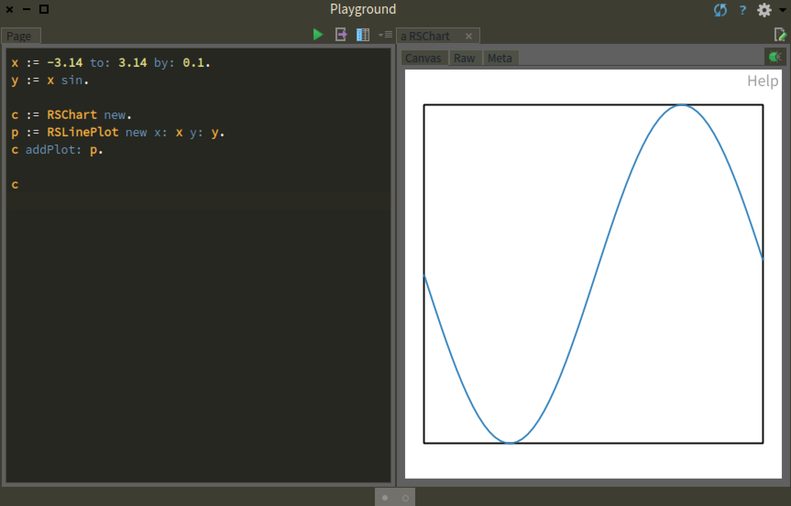
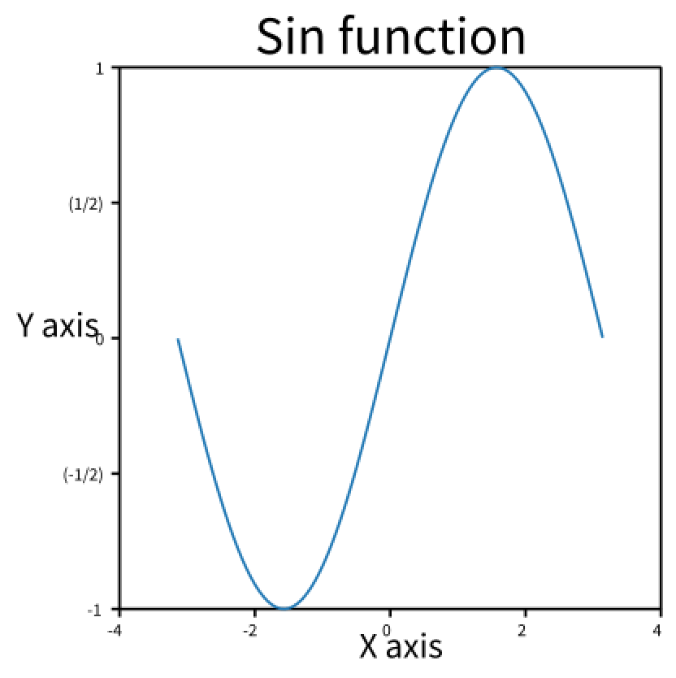
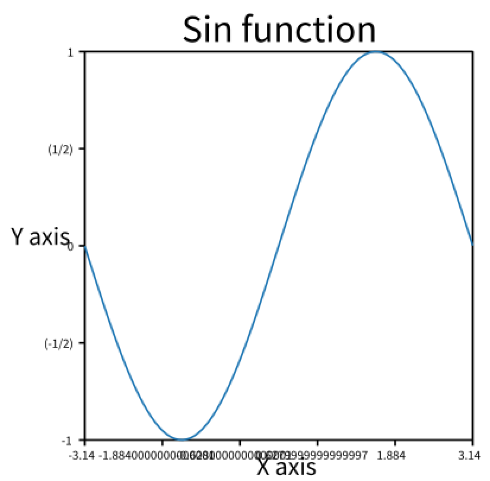
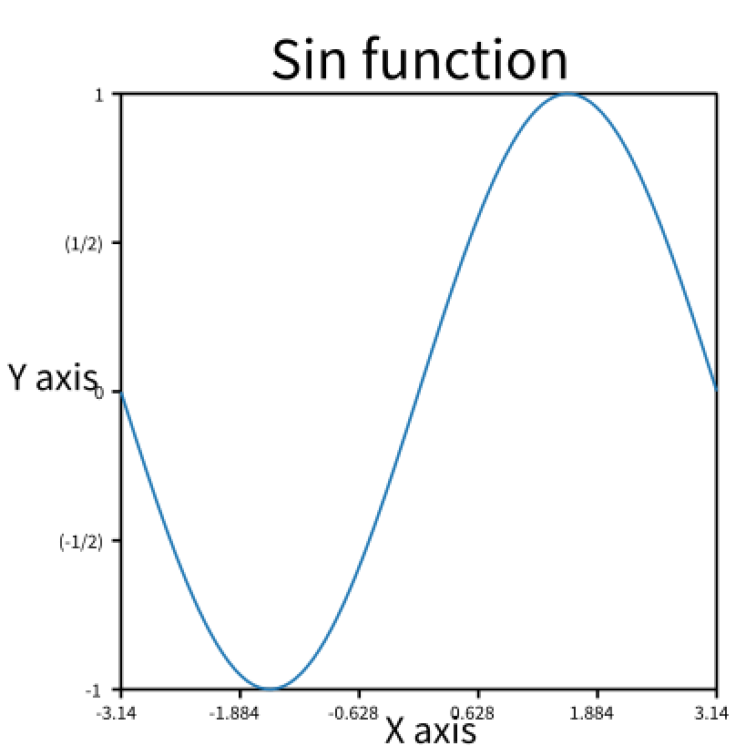
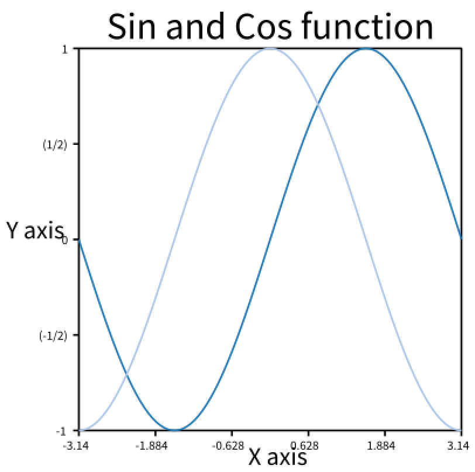
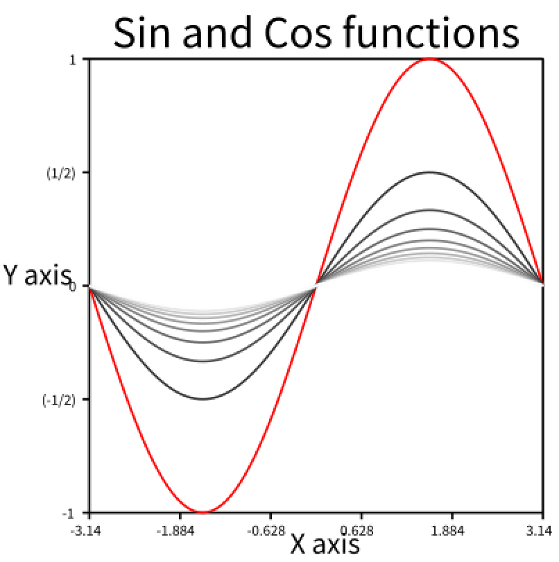
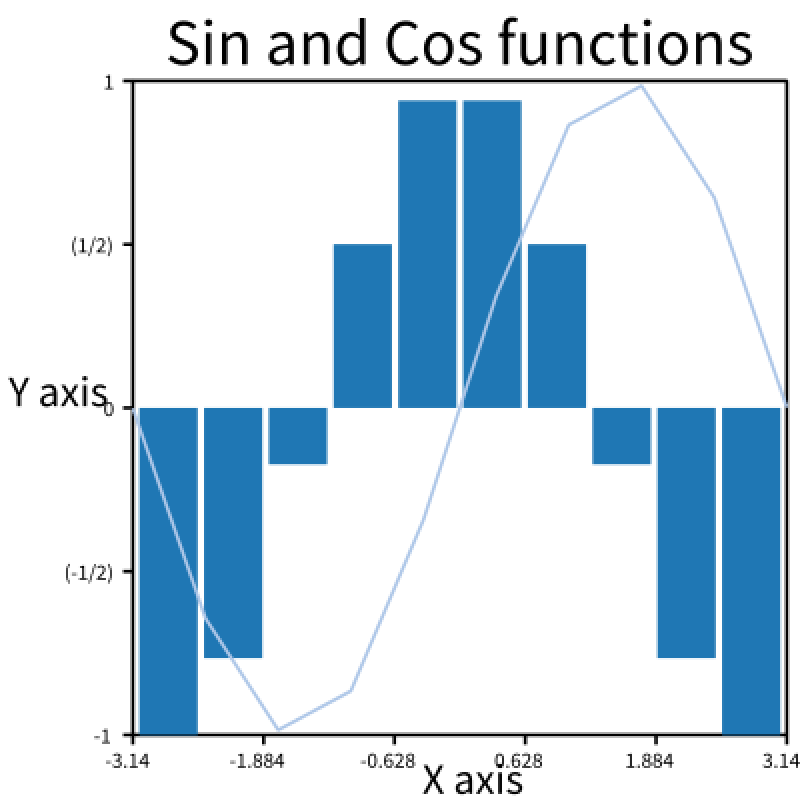
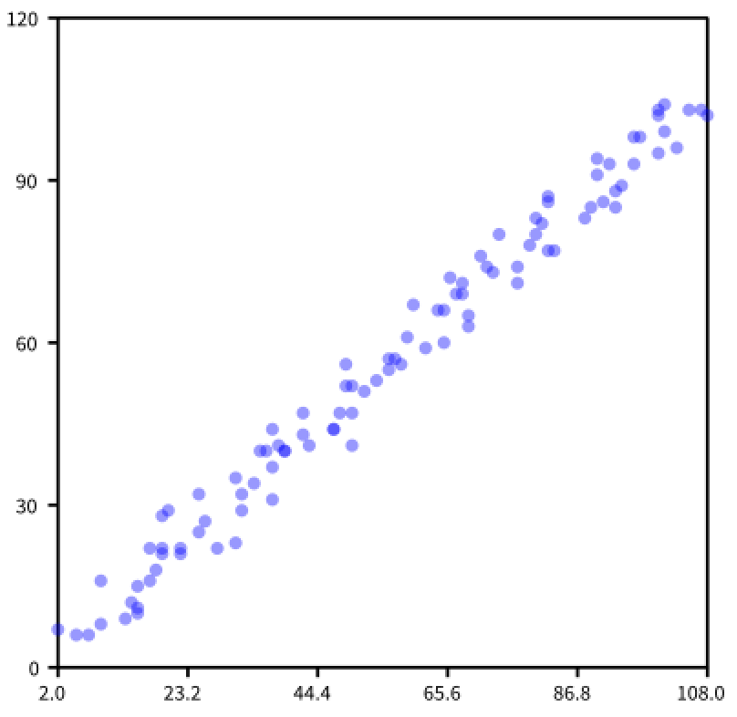
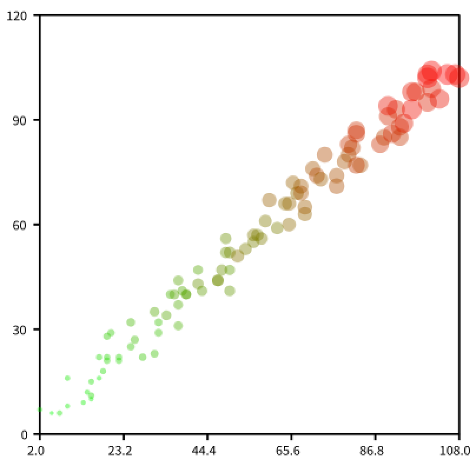
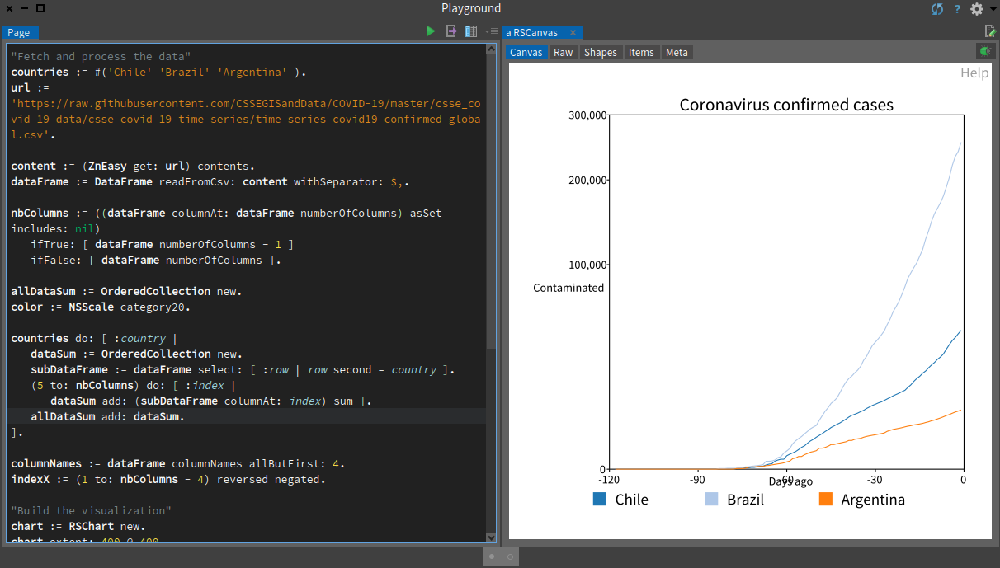

# Tutorial 05 - Charting

Here is another tutorial for [Roassal3](https://github.com/ObjectProfile/Roassal3).

What you will learn in this tutorial:
- the essential features of Chart, the Roassal component to draw charts;
- create and visualize a chart from a given set of numbers found in a CSV file;
- parse a CSV file using `DataFrame`.

The topic of this tutorial is charting. It will gently introduce the charting library Roassal3 offers through some contrivied example at first, and then visualize a real dataset.

## Simple example

Consider the following script:

```Smalltalk
x := -3.14 to: 3.14 count: 100.
y := x sin.

c := RSChart new.
p := RSLinePlot new x: x y: y.
c addPlot: p.

c
```

The result of the script is given by the figure:


We will now review the script line by line. The first two lines define the data, expressed with the two variables `x` and `y`, we wish to visualize. Remember that the message `to:count:` defined a collection of 100 numerical values, ranging from `-3.14` to `3.14`.

The class `RSChart` is a container of plots. We add a new plot called `RSLinePlot` to the chart. The script ends with the value `c`, which visualizes the chart thanks to the Pharo inspector framework.

Some decorations can be added to our script to annotate the graphics. Consider:

```Smalltalk
x := -3.14 to: 3.14 count: 100.
y := x sin.

c := RSChart new.
p := RSLinePlot new x: x y: y.
c addPlot: p.

c title: 'Sine function'.
c xlabel: 'X axis'.
c ylabel: 'Y axis'.

c addDecoration: RSHorizontalTick new.
c addDecoration: RSVerticalTick new.
c
```

Ultimately, the message `title:`, `xlabel:`, and `ylabel:` make use of `addDecoration:` to decorate the graphic. The last two decoration `RSHorizontalTick` and `RSVerticalTick` add ticks to the two axes.



## Nice labels

The previous script added the horizontal and vertical ticks, which produces a rather simple and intuitive results. However, a significant machinery is behind these ticks. Consider, the `x` values, which ranges from `-3.14` to `3.14`. The graphic shows the X axis that ranges from `-4` to `4`. How does Chart determine that it is better to have `4` rather than `3.14`? A complex search algorithm tries to have the better configuration of the ticks and labels. Such a behavior can be overriden as follow:


```Smalltalk
x := -3.14 to: 3.14 count: 100.
y := x sin.

c := RSChart new.
p := RSLinePlot new x: x y: y.
c addPlot: p.

c title: 'Sine function'.
c xlabel: 'X axis'.
c ylabel: 'Y axis'.

c addDecoration: RSHorizontalTick new doNotUseNiceLabel.
c addDecoration: RSVerticalTick new.
c
```

The result of not using nice labels may be seen in:


The X axis ranges from `-3.14` to `3.14`, however intermediary ticks have unecessary large floating values.

```Smalltalk
x := -3.14 to: 3.14 count: 100.
y := x sin.

c := RSChart new.
p := RSLinePlot new x: x y: y.
c addPlot: p.

c title: 'Sine function'.
c xlabel: 'X axis'.
c ylabel: 'Y axis'.

c addDecoration: (RSHorizontalTick new doNotUseNiceLabel asFloat: 3).
c addDecoration: RSVerticalTick new.
c
```

The instruction `asFloat: 3` makes that each value in a tick has at most 3 decimals. The result is:




## Coloring multiple plots

Several plots may be added to a chart object. Consider:

```Smalltalk
x := -3.14 to: 3.14 count: 100.

c := RSChart new.
p := RSLinePlot new x: x y: x sin.
c addPlot: p.

p := RSLinePlot new x: x y: x cos.
c addPlot: p.

c title: 'Sine and Cosine functions'.
c xlabel: 'X axis'.
c ylabel: 'Y axis'.

c addDecoration: (RSHorizontalTick new doNotUseNiceLabel asFloat: 3).
c addDecoration: RSVerticalTick new.
c
```

Result is seen in:




Colors may be set to each plot. Consider the following example:

```Smalltalk
x := -3.14 to: 3.14 count: 100.

c := RSChart new.
1 to: 10 do: [ :att |
	p := RSLinePlot new x: x y: x sin / att.
	att = 1
		ifTrue: [ p color: Color red ]
		ifFalse: [ p color: (Color gray: att / 10) ].
	c addPlot: p.
].


c title: 'Sine and Cosine functions'.
c xlabel: 'X axis'.
c ylabel: 'Y axis'.

c addDecoration: (RSHorizontalTick new doNotUseNiceLabel asFloat: 3).
c addDecoration: RSVerticalTick new.

c
```

The result could seen in:



## Multiple type of plots

Plots can be combined in various different ways. The following example combine a bar plot and a line plot:

```Smalltalk
x := -3.14 to: 3.14 count: 10.

c := RSChart new.
c addPlot: (RSBarPlot new x: x y: x cos).
c addPlot: (RSLinePlot new x: x y: x sin).

c title: 'Sine and Cosine functions'.
c xlabel: 'X axis'.
c ylabel: 'Y axis'.

c addDecoration: (RSHorizontalTick new doNotUseNiceLabel asFloat: 3).
c addDecoration: RSVerticalTick new.

c
```

Result is:



`RSScatterPlot` is another type of plot useful to visualize multiple dimentions. Consider the following example:

```Smalltalk
x := OrderedCollection new.
y := OrderedCollection new.
z := OrderedCollection new.
r := Random seed: 42.
1 to: 100 do: [ :i |
	x add: i + (r nextInt: 10).
	y add: i + (r nextInt: 10).
	z add: i + (r nextInt: 10).
].

c := RSChart new.
p := RSScatterPlot new x: x y: y.
p color: Color blue translucent.
c addPlot: p.

c addDecoration: (RSHorizontalTick new doNotUseNiceLabel asFloat: 3).
c addDecoration: RSVerticalTick new.

c
```

The result is:



Shapes produced by a chart may be normalized in numerous ways. For example:

```Smalltalk
x := OrderedCollection new.
y := OrderedCollection new.
z := OrderedCollection new.
r := Random seed: 42.
1 to: 100 do: [ :i |
	x add: i + (r nextInt: 10).
	y add: i + (r nextInt: 10).
	z add: i + (r nextInt: 10).
].

c := RSChart new.
p := RSScatterPlot new x: x y: y.
p processBlock: [ :shapes |
		shapes models: z.
		RSNormalizer size
			shapes: shapes;
			from: 2;
			to: 10;
			normalize: #yourself.
		RSNormalizer color
			shapes: shapes;
			normalize: #yourself.
		shapes translucent.
			 ].
c addPlot: p.

c addDecoration: (RSHorizontalTick new doNotUseNiceLabel asFloat: 3).
c addDecoration: RSVerticalTick new.

c
```

The result is:



## COVID-19 dataset

As a larger example, we will visualize the COVID-19 dataset provided by the [Johns Hopkins University](https://www.jhu.edu), available [online](https://github.com/CSSEGISandData/COVID-19). To process the dataset, we will use data frame, which is an excellent library to easily process CSV files. Data frame is developed by [Olek](https://github.com/olekscode).

To load data frame, you can execute the following script:

```Smalltalk
Metacello new
  baseline: 'DataFrame';
  repository: 'github://PolyMathOrg/DataFrame:v2.0/src';
  load.
```


Consider the following script. It is a long but complex script.

```Smalltalk
"Fetch and process the data"
countries := #('Chile' 'Brazil' 'Argentina' ).
url := 'https://raw.githubusercontent.com/CSSEGISandData/COVID-19/master/csse_covid_19_data/csse_covid_19_time_series/time_series_covid19_confirmed_global.csv'.

content := (ZnEasy get: url) contents.
dataFrame := DataFrame readFromCsv: content withSeparator: $,.

nbColumns := ((dataFrame columnAt: dataFrame numberOfColumns) asSet includes: nil)
	ifTrue: [ dataFrame numberOfColumns - 1 ]
	ifFalse: [ dataFrame numberOfColumns ].

allDataSum := OrderedCollection new.
color := NSScale category20.

countries do: [ :country |
	dataSum := OrderedCollection new.
	subDataFrame := dataFrame select: [ :row | row second = country ].
	(5 to: nbColumns) do: [ :index |
		dataSum add: (subDataFrame columnAt: index) sum ].
	allDataSum add: dataSum.
].

columnNames := dataFrame columnNames allButFirst: 4.
indexX := (1 to: nbColumns - 4) reversed negated.

"Build the visualization"
chart := RSChart new.
chart extent: 400 @ 400.
chart colors: color.
allDataSum do: [ :data | chart addPlot:(RSLinePlot new x: indexX y: data) ].
chart xlabel: 'Days ago'.
chart ylabel: 'Contaminated'.
chart title: 'Coronavirus confirmed cases'.
chart addDecoration: (RSHorizontalTick new  fontSize: 10).
chart addDecoration: (RSVerticalTick new integerWithCommas; fontSize: 10).
chart ySqrt.
chart build.

b := RSLegend new.
b container: chart canvas.
countries with: chart plots do: [ :c : p |
	b text: c withBoxColor: (chart colorFor: p) ].
b layout horizontal gapSize: 30.
b build.
b canvas
```

The result is:



The script uses:
  - a legend to clearly associate the curve to a country,
  - particular font size for the labels on the ticks,
  - labels on the vertical ticks are integer with a comma to separate the group of thousands digit,
  - a square-root normalization on the vertical axis


# What have we seen in this tutorial?

This tutorial is about chart, a component of Roassal to display charts. The tutorial went through the following steps:

  - We first used a simple and contrived example using mathematical functions;
  - We show a simple way to control the way labels are rendered;
  - We then illustrated how to combine multiple plots;
  - A larger and realistic example was presented
