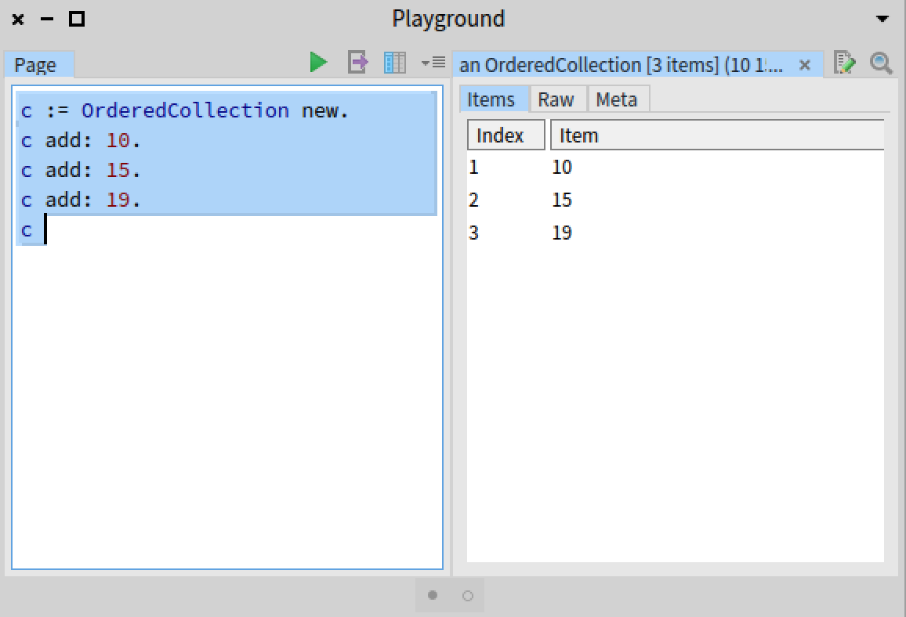
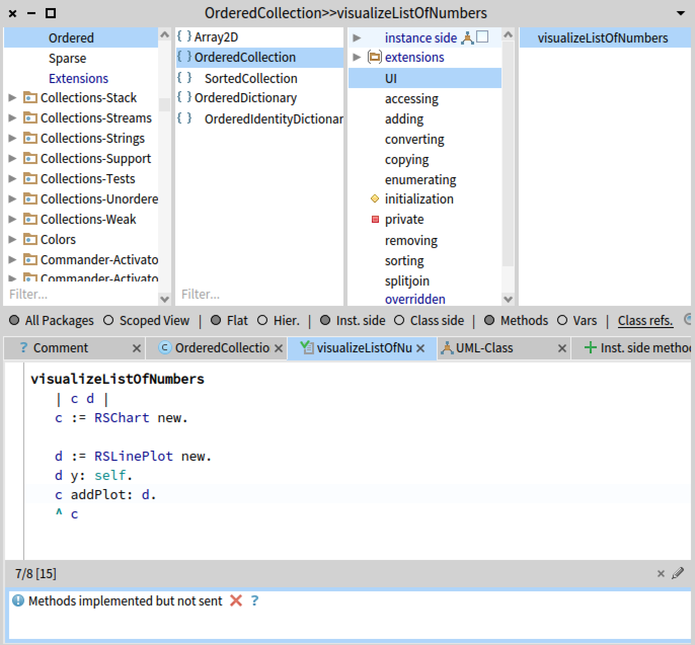
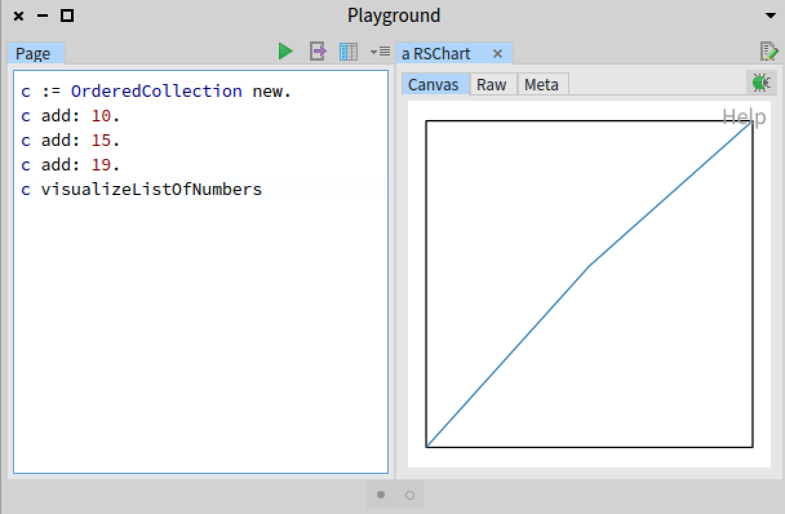
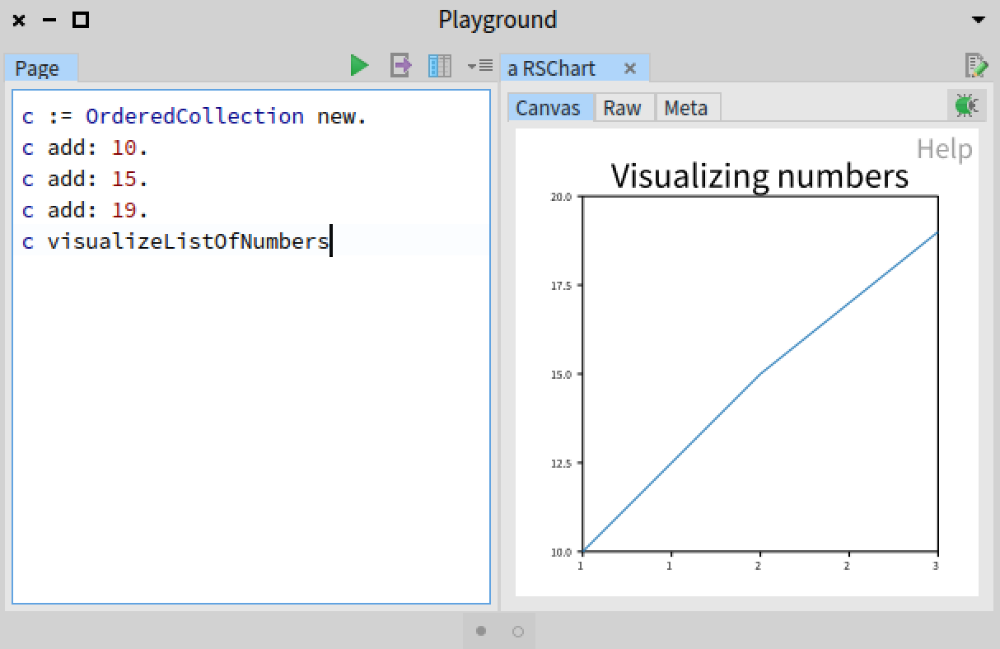
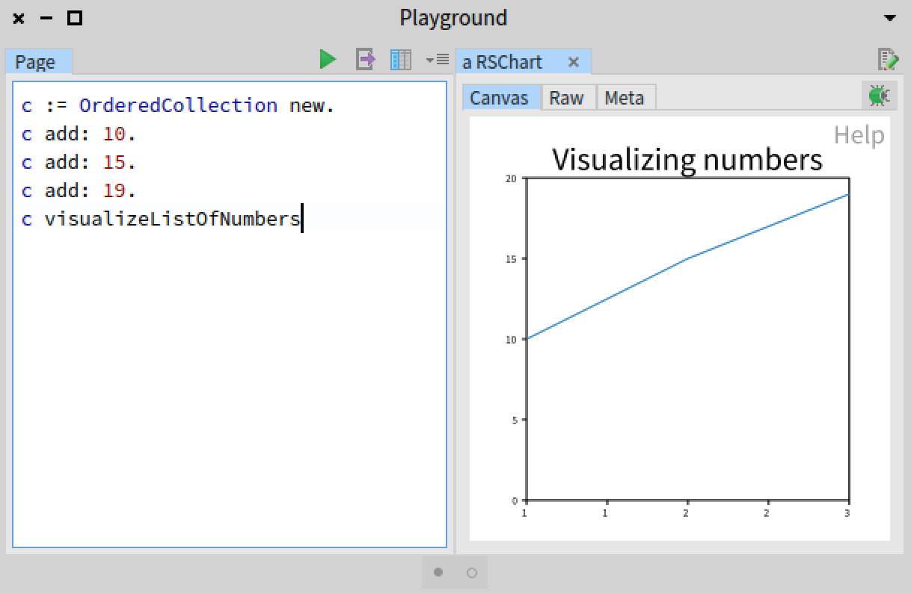
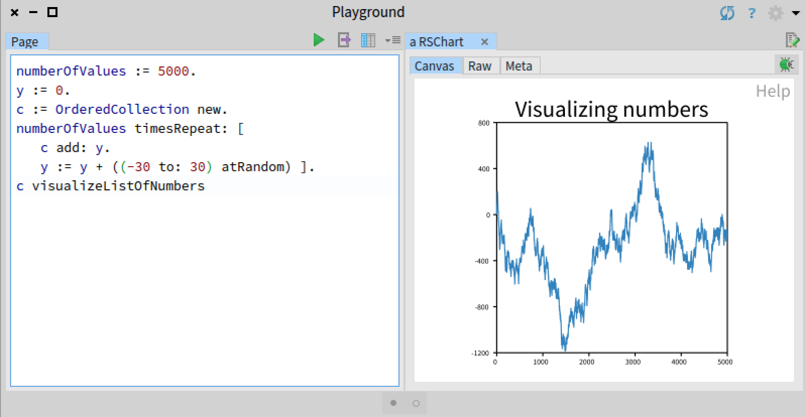
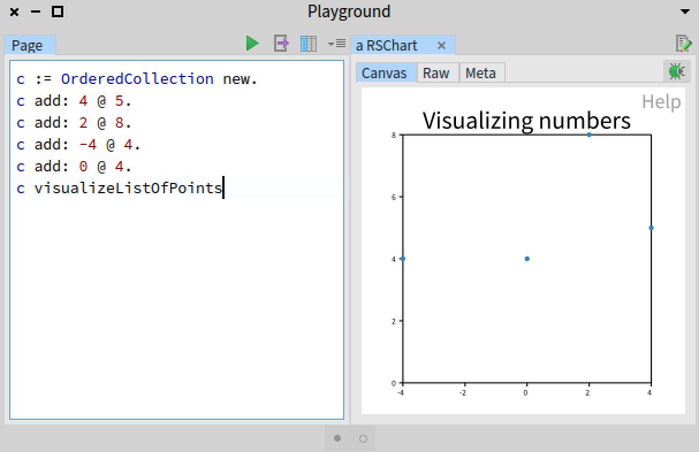
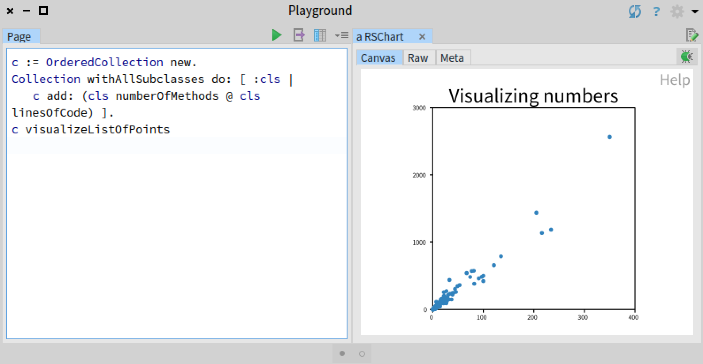
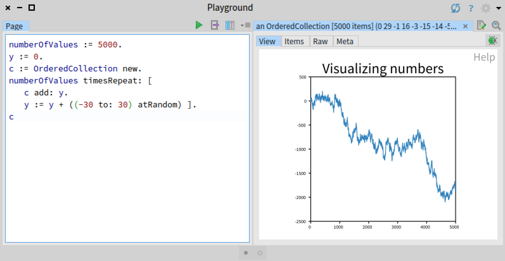

# Tutorial 03 - Inspector Integration

Pharo offers many powerful and expressive software development tools. One of them is the inspector, made to _inspect_ any Pharo object.
The inspector is a central tool in Pharo as it allow one to (i) see the internal representation of an object, (ii) intimely interact with an object through an evaluation panel, and (iii) define visual representations of an object. This tutorial covers the use of visual object representation.

## Pharo inspector

First of all, the inspector may be invoked in a number of different ways. You can send the message `inspect` to any object to open an inspector. For example, you can open a playground and execute the following code by pressing `Cmd-d` / `Alt-d` or right clicking on [`Do It`](../screenshots/Tutorial03-Inspector.png):

```Smalltalk
c := OrderedCollection new.
c add: 10.
c add: 15.
c add: 19.
c inspect
```

You can also use a keystroke `Cmg-g` / `Alt-g` to embed the inspector in the playground window from the following code:

```Smalltalk
c := OrderedCollection new.
c add: 10.
c add: 15.
c add: 19.
c
```

You should obtain the following:



Either way, you see that the inspector lists three tabs, _Items_, _Raw_, and _Meta_. The first tab list the items contained in the list, the second gives the internal structure of the ordered collection object, and the last one gives the list of methods. In the following, we will see how we can add a Roassal visualization as a tab when inspecting an ordered collection, as we do.

## Visualizing a collection of numbers

Open a system browser on the class `OrderedCollection` and define the following method:

```Smalltalk
OrderedCollection>>visualizeListOfNumbers
	| c d |
	c := RSChart new.
	d := RSLinePlot new.
	d y: self.
	c addPlot: d.
	c build.
	^ c canvas
```

In the system browser you should have:




The visualization can be invoked as follows:

```Smalltalk
c := OrderedCollection new.
c add: 10.
c add: 15.
c add: 19.
c visualizeListOfNumbers
```

You should obtain the following result:



Our visualization can be improved by adding a title ticks:

```Smalltalk
visualizeListOfNumbers
	| c d |
	c := RSChart new.
	d := RSLinePlot new.
	d y: self.
	c addPlot: d.
	c title: 'Visualizing numbers'.
	c addDecoration: RSVerticalTick new.
	c addDecoration: RSHorizontalTick new.
	c build.
	^ c canvas
```

You should have the following:



If you wish to have the value 0 included, then you can use the method `mustInclude0inY`, as in this new version:

```Smalltalk
visualizeListOfNumbers
	| c d |
	c := RSChart new.
	d := RSLinePlot new.
	d y: self.
	c addPlot: d.
	c title: 'Visualizing numbers'.
	c addDecoration: RSVerticalTick new.
	c addDecoration: RSHorizontalTick new.
	c mustInclude0InY.
	c build.
	^ c canvas
```

You will then have:



Our small visualization easily scale up. Consider the following script:

```Smalltalk
numberOfValues := 1000.
y := 0.
c := OrderedCollection new.
numberOfValues timesRepeat: [
	c add: y.
	y := y + ((-30 to: 30) atRandom) ].
c visualizeListOfNumbers
```

It plots 1000 values:




## Generic way to visualize a list of value

We could build additional list of visualization. Consider the method to visualize a list of points:
```Smalltalk
OrderedCollection>>visualizeListOfPoints
	| c x y |
	x := self collect: [ :p | p x ].
	y := self collect: [ :p | p y ].
	c := RSChart new.
	c addPlot: (RSScatterPlot new x: x y: y).
	c title: 'Visualizing numbers'.
	c addDecoration: RSVerticalTick new.
	c addDecoration: RSHorizontalTick new.
	c mustInclude0inX.
	c mustInclude0inY.
	c build.
	^ c canvas
```

Consider the example:

```Smalltalk
c := OrderedCollection new.
c add: 4 @ 5.
c add: 2 @ 8.
c add: -4 @ 4.
c add: 0 @ 4.
c visualizeListOfPoints
```

It produces the following:




A larger example may be:

```Smalltalk
c := OrderedCollection new.
Collection withAllSubclasses do: [ :cls |
	c add: (cls numberOfMethods @ cls linesOfCode) ].
c visualizeListOfPoints
```

It produces the following:




We can also have a particular visualization for collections that contains character strings, as follows:

```Smalltalk
OrderedCollection>>visualizeListOfStrings
	| c groups labels |
	c := RSCanvas new.
	groups := (self groupedBy: #yourself) associationsSelect: [ :as | as value size > 1 ].
	labels := groups keys collect: [ :aString | RSLabel new text: aString; model: aString ].
	c addAll: labels.
	RSNormalizer fontSize
		shapes: labels;
		scale: (NSScale sqrt);
		from: 5; to: 30;
		normalize: [ :aString | (groups at: aString) size ].
	RSFlowLayout on: labels.
	c @ RSCanvasController.
	^ c
```

A simple example could be:

```Smalltalk
c := OrderedCollection new.
Collection withAllSubclassesDo: [ :cls |
	c addAll: cls comment substrings ].
c visualizeListOfStrings
```


## Choosing the visualization based on the type of its contained elements

We can select the right visualization based on the content of the collection:

```Smalltalk
OrderedCollection>>visualize
	| allTypes |
	self isEmpty ifTrue: [ ^ self ].
	allTypes := (self collect: [ :e | e class ]) asSet asArray.
	(allTypes allSatisfy: [ :c | c inheritsFrom: Number ]) ifTrue: [ ^ self visualizeListOfNumbers ].
	(allTypes allSatisfy: [ :c | c inheritsFrom: Point ]) ifTrue: [ ^ self visualizeListOfPoints ].
	(allTypes allSatisfy: [ :c | c inheritsFrom: String ]) ifTrue: [ ^ self visualizeListOfStrings ].
```

## Hooking the inspector

So far, we have always called a visualize method to see the visualization. This method may be automatically called by the inspector framework by defining the method:

```Smalltalk
OrderedCollection>>gtInspectorViewIn: composite
	<gtInspectorPresentationOrder: -10>
	composite roassal3
		title: 'View';
		initializeCanvas: [ self visualize ]
```

Here is an example:



