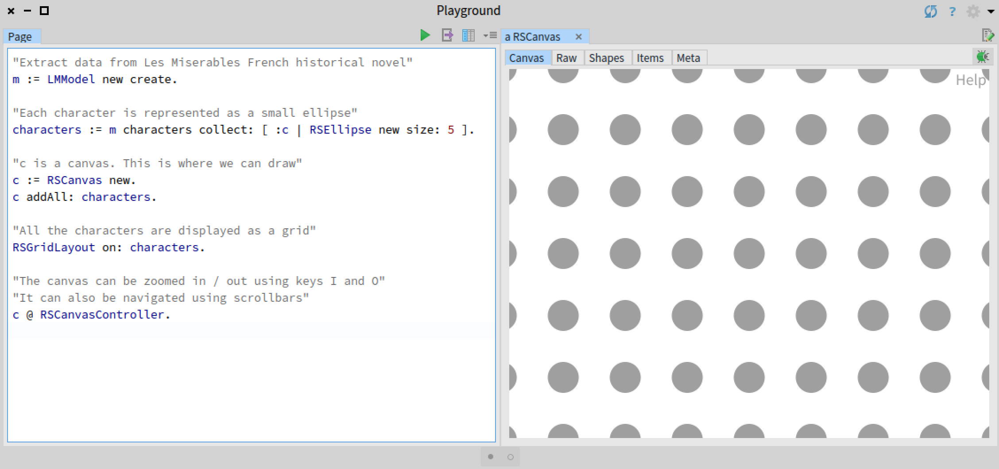
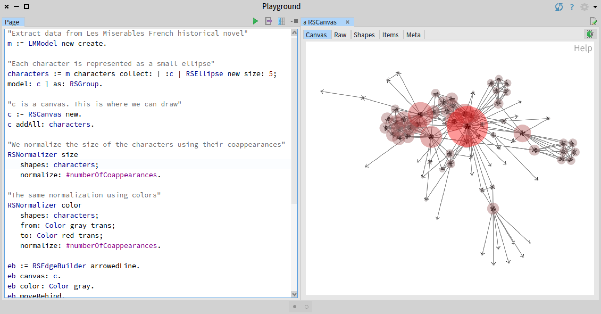
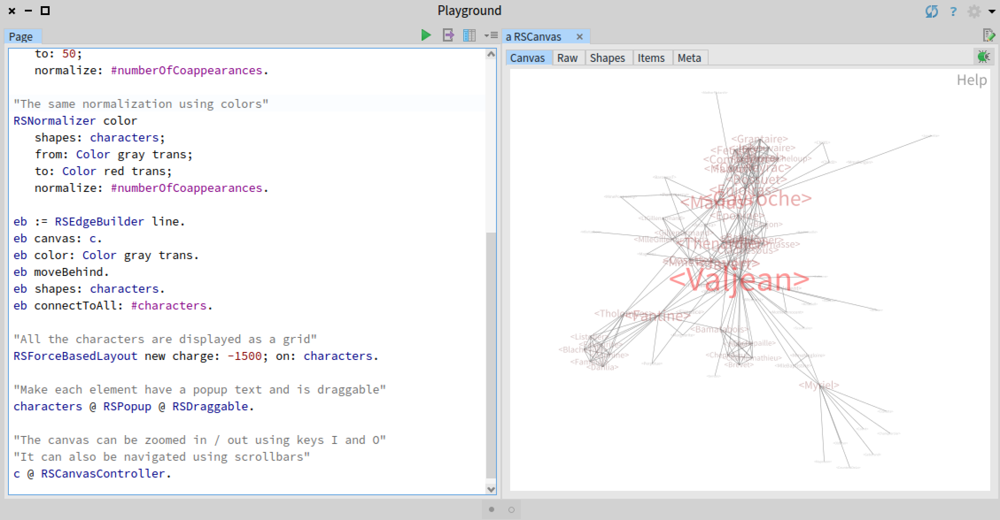
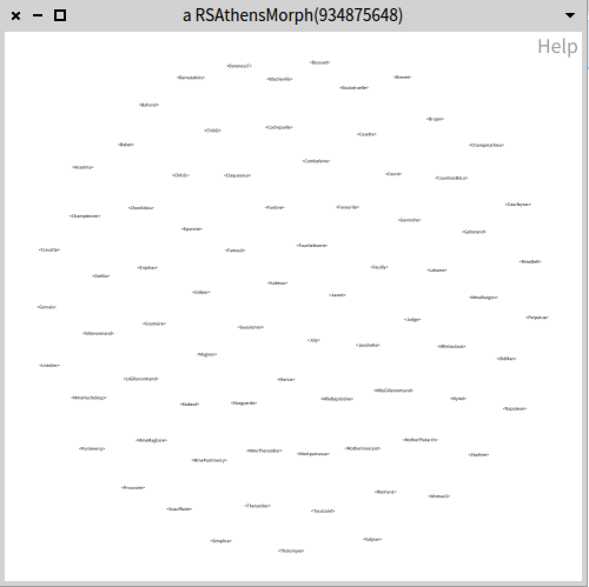
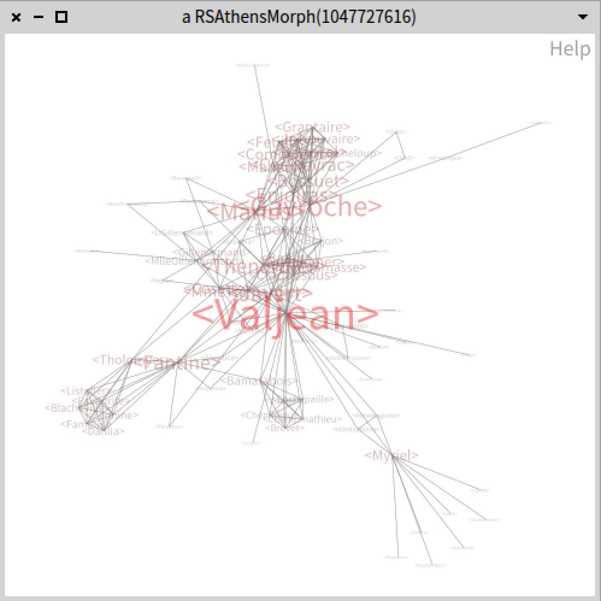
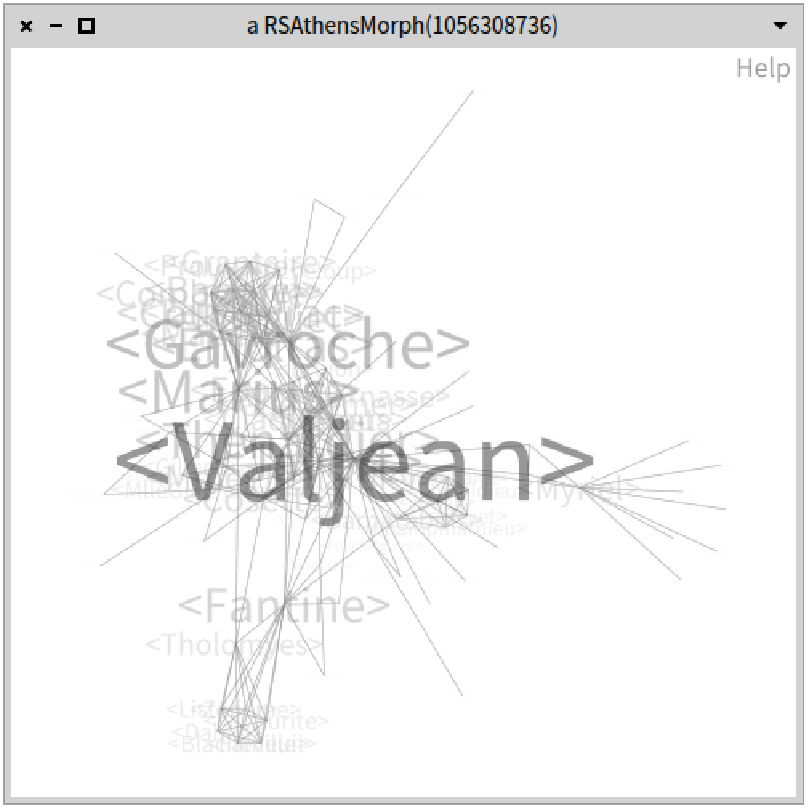
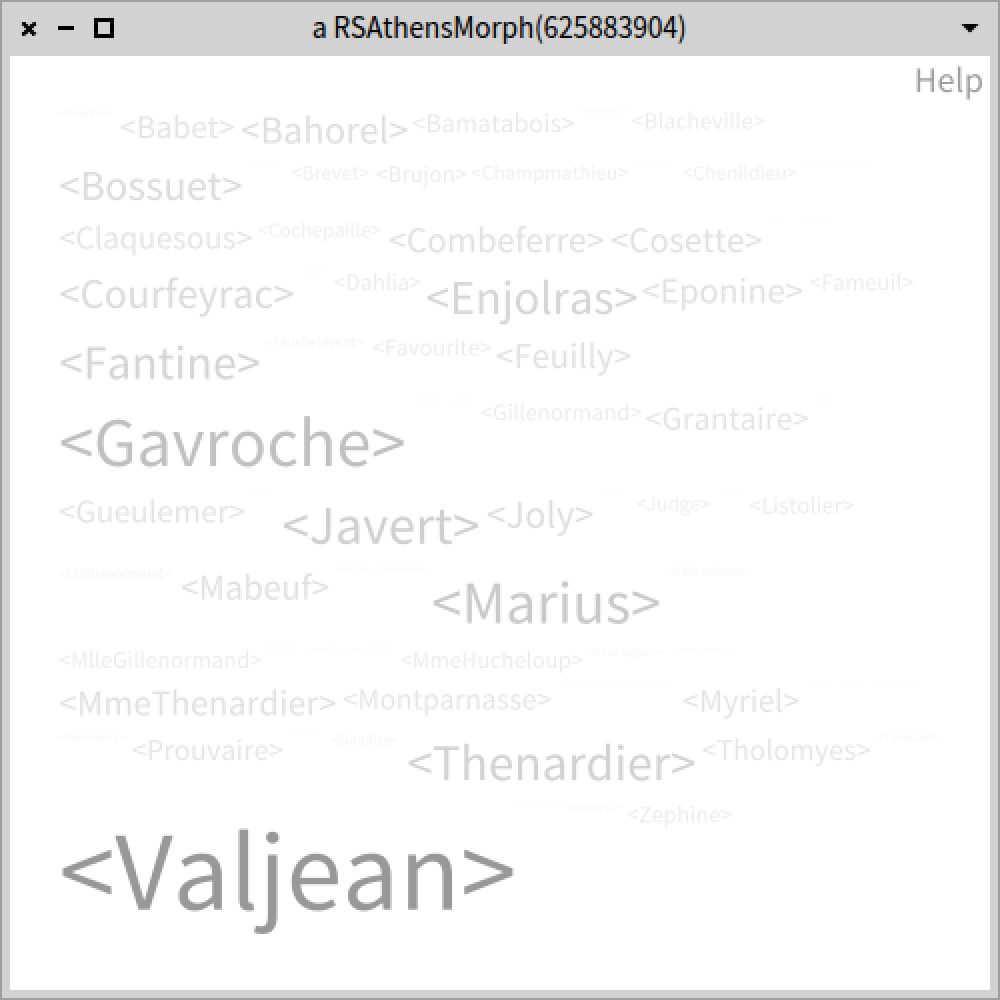

# Tutorial 01 - Adding Simple Nodes, Edges, and Layout

This is a tutorial for Roassal3. In order to go through it, you need to have [Pharo](https://pharo.org) installed, and [Roassal3](https://github.com/ObjectProfile/Roassal3) installed.

This tutorial involves some data manipulation. We will use the dataset of [Les Miserables](https://github.com/bergel/LesMiserables), which can be loaded in Pharo using:

```Smalltalk
Metacello new
    baseline: 'LesMiserables';
    repository: 'github://bergel/LesMiserables';
    load.
```

The dataset essentially contains two kind of valuables data: _characters_ of the historical novel and _coappearances_ of the characters. We will visualize these data.

After loading Les Miserables and Roassal3, you can execute the following script:

```Smalltalk
"Extract data from Les Miserables French historical novel"
m := LMModel new create.

"Each character is represented as a small ellipse"
characters := m characters collect: [ :c | RSEllipse new size: 5 ].

"c is a canvas. This is where we can draw"
c := RSCanvas new.
c addAll: characters.

"All the characters are displayed as a grid"
RSGridLayout on: characters.

"The canvas can be zoomed in / out using keys I and O"
"It can also be navigated using scrollbars"
c @ RSCanvasController.

```

This produces the following picture:


We can normalize the size of each character based on the number of times she or he coappears:

```Smalltalk
"Extract data from Les Miserables French historical novel"
m := LMModel new create.

"Each character is represented as a small ellipse"
characters := m characters collect: [ :c | RSEllipse new size: 5; model: c ] as: RSGroup.

"c is a canvas. This is where we can draw"
c := RSCanvas new.
c addAll: characters.

"We normalize the size of the characters using their coappearances"
RSNormalizer size
	shapes: characters;
	normalize: #numberOfCoappearances.

"All the characters are displayed as a grid"
RSGridLayout on: characters.

"Make each element have a popup text"
characters @ RSPopup.

"The canvas can be zoomed in / out using keys I and O"
"It can also be navigated using scrollbars"
c @ RSCanvasController.
```


We can add edges to indicate coappearances:
```Smalltalk
"Extract data from Les Miserables French historical novel"
m := LMModel new create.

"Each character is represented as a small ellipse"
characters := m characters collect: [ :c | RSEllipse new size: 5; model: c ] as: RSGroup.

"c is a canvas. This is where we can draw"
c := RSCanvas new.
c addAll: characters.

"We normalize the size of the characters using their coappearances"
RSNormalizer size
	shapes: characters;
	normalize: #numberOfCoappearances.

"The same normalization using colors"
RSNormalizer color
	shapes: characters;
	from: Color gray trans;
	to: Color red trans;
	normalize: #numberOfCoappearances.

eb := RSEdgeBuilder arrowedLine.
eb canvas: c.
eb color: Color gray.
eb moveBehind.
eb 	shapes: characters.
eb connectToAll: #characters.

"All the characters are displayed as a grid"
RSForceBasedLayout new charge: -900; on: characters.

"Make each element have a popup text and is draggable"
characters @ RSPopup @ RSDraggable.

"The canvas can be zoomed in / out using keys I and O"
"It can also be navigated using scrollbars"
c @ RSCanvasController.
```


Circles can be replaced with labels:
```Smalltalk
"Extract data from Les Miserables French historical novel"
m := LMModel new create.

"Each character is represented as a label"
characters := m characters collect: [ :c | RSLabel
    new size: 5;
    text: c;
    model: c ] as: RSGroup.

"c is a canvas. This is where we can draw"
c := RSCanvas new.
c addAll: characters.

"We normalize the font size of the characters using their coappearances"
RSNormalizer fontSize
	shapes: characters;
	from: 5;
	to: 50;
	normalize: #numberOfCoappearances.

"The same normalization using colors"
RSNormalizer color
	shapes: characters;
	from: Color gray trans;
	to: Color red trans;
	normalize: #numberOfCoappearances.

eb := RSEdgeBuilder arrowedLine.
eb canvas: c.
eb color: Color gray trans.
eb moveBehind.
eb 	shapes: characters.
eb connectToAll: #characters.

"The characters are displayed as a force-directed graph"
RSForceBasedLayout new charge: -1500; on: characters.

"Make each element have a popup text and is draggable"
characters @ RSPopup @ RSDraggable.

"The canvas can be zoomed in / out using keys I and O"
"It can also be navigated using scrollbars"
c @ RSCanvasController.
```


So far we interactively built a script to visualize a small dataset. Although a good start, it is not really adequate when extensible and customizable code is expected. A script, such as the one we provided, has the benefit to be consise and self-contained, but it is relatively complex and require an overall understanding to be adapted and extend. We can wrap it into a dedicated class and cut the script into particular methods. As such, we can create the class `LesMiserableVisualization`:

```Smalltalk
Object subclass: #LesMiserableVisualization
	instanceVariableNames: 'model canvas characters'
	classVariableNames: ''
	package: 'LesMiserableVisualization'
```

The temporary variables we had in our script are turned into instance variables. The initialization can be done in the `initialize` method:

```Smalltalk
LesMiserableVisualization>>>initialize
	super initialize.
	canvas := RSCanvas new.

	"The canvas can be zoomed in / out using keys I and O"
	"It can also be navigated using scrollbars"
	canvas @ RSCanvasController.

	self createModel.
```

The creation of the model is achieved using:

```Smalltalk
LesMiserableVisualization>>>createModel
	"Create the model and create visual characters"
	model := LMModel new create.
	self createCharacters.
```

The characters may be built with:

```Smalltalk
LesMiserableVisualization>>>createCharacters
	"Create a visual element for each character of Les Miserables"
	"Each character is represented as a label"
	characters := model characters
		collect: [ :c |
			RSLabel new size: 5; text: c; model: c ]
		as: RSGroup.

	"Add the characters to the canvas"
	canvas addAll: characters.

	"Make each element have a popup text and is draggable"
	characters @ RSPopup @ RSDraggable.
```

We can now focus on the necessary methods to actually build the visualization. Consider the following methods to build coapperance relationship:
```Smalltalk
LesMiserableVisualization>>>addLines
	self addLinesColored: Color gray
```

```Smalltalk
LesMiserableVisualization>>>addLinesColored: aColor
	"Add coappearances using colored lines "
	| eb |
	eb := RSEdgeBuilder line.
	eb canvas: canvas.
	eb color: aColor trans.
	eb moveBehind.
	eb shapes: characters.
	eb connectToAll: #characters.
```

Similarly, we can provide the necessary methods to adjust colors of the characters:
```Smalltalk
LesMiserableVisualization>>>adjustColor
	self adjustColorShapeFrom: Color gray to: Color red
```

```Smalltalk
LesMiserableVisualization>>>adjustColorShapeFrom: color1 to: color2
	"Normalizing the characters"
	RSNormalizer color
		shapes: characters;
		from: color1 trans;
		to: color2 trans;
		normalize: #numberOfCoappearances.
```

The font shapes may be adjusted in a similar fashion:
```Smalltalk
LesMiserableVisualization>>>adjustFontShape
	self adjustFontShapeFrom: 5 to: 50
```

```Smalltalk
LesMiserableVisualization>>>adjustFontShapeFrom: smallFontSize to: bigFontSize
	"We normalize the font size of the characters using their coappearances"
	RSNormalizer fontSize
		shapes: characters;
		from: smallFontSize;
		to: bigFontSize;
		normalize: #numberOfCoappearances.
```

Layout can be achieved using the following two methods:

```Smalltalk
LesMiserableVisualization>>>doLayout
	self doLayout: (RSForceBasedLayout new charge: -1500)
```

```Smalltalk
LesMiserableVisualization>>>doLayout: aLayout
	"Perform the layout on the characters"
	aLayout on: characters
```

The visualization can be open using:

```Smalltalk
LesMiserableVisualization>>>open
	"Open the Roassal canvas"
	canvas open
```

By cutting the original scripts into a set of parametrizable methods, we turned our script into a small and customizabler application. For example, we can perform:

```Smalltalk
LesMiserableVisualization new
	doLayout;
	open
```

to produce:


We can refine the script to have:
```Smalltalk
LesMiserableVisualization new
	adjustColor;
	adjustFontShape;
	addLines;
	doLayout;
	open
```

to produce:


Variant of the visualization may be easily built:

```Smalltalk
LesMiserableVisualization new
	adjustColorShapeFrom: Color white to: Color black;
	adjustFontShapeFrom: 5 to: 100;
	addLines;
	doLayout;
	open
```

to produce:


A new layout may be adopted:

```Smalltalk
LesMiserableVisualization new
	adjustColorShapeFrom: Color white to: Color black;
	adjustFontShapeFrom: 5 to: 100;
	doLayout: (RSFlowLayout new);
	open
```

to produce:

