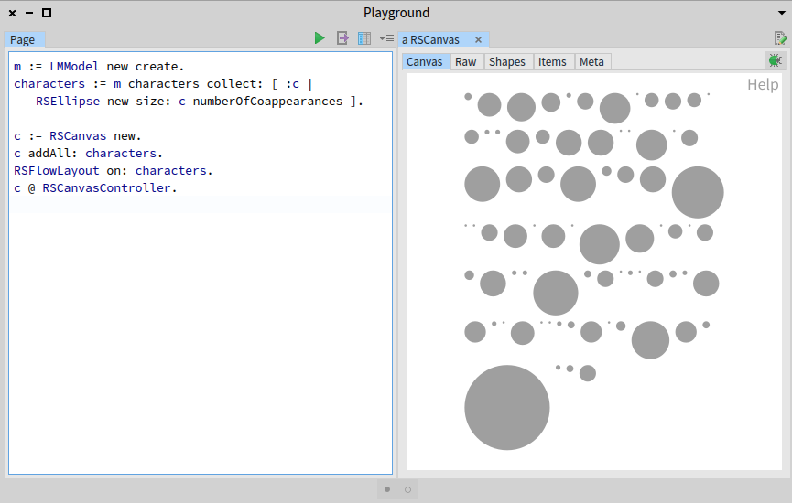
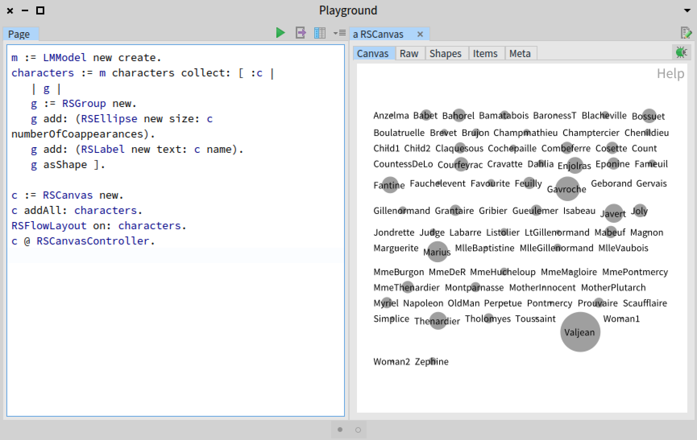
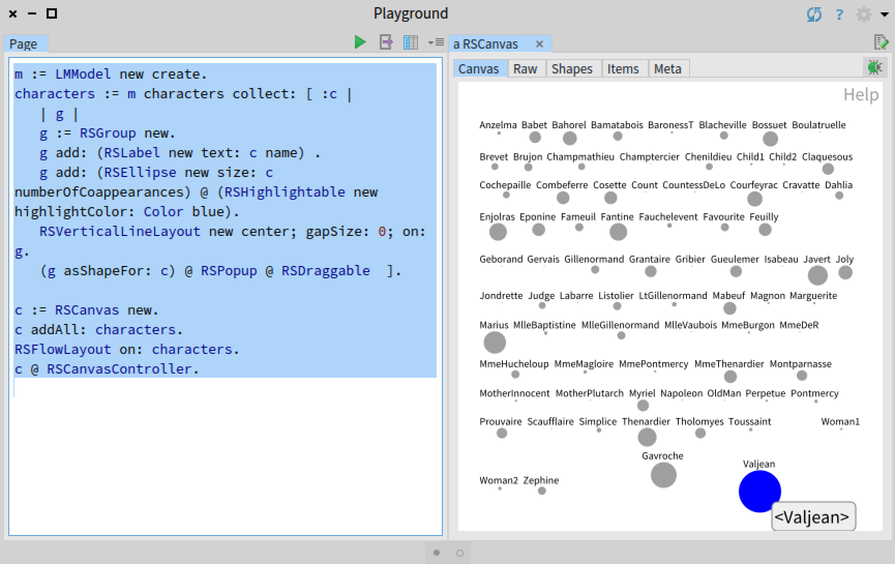
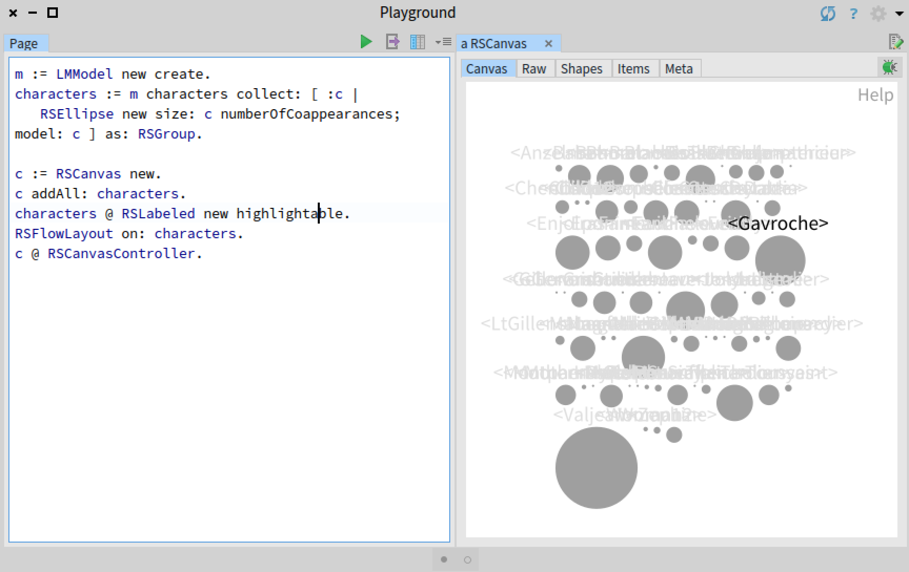

# Tutorial 04 - Shapes compositions

In the previous tutoriales, we have essentially used individual shapes to describes one single domain element. Consider the code we employed in this [tutorial](https://github.com/ObjectProfile/Roassal3/blob/master/documentation/LesMiserables.md). Each shape (i.e., visual element) corresponds to one character of the Les Miserables. This tutorial is about composing shapes to create a sophisticated visual glyph.

## Les Miserable dataset

We will use the dataset available [here](https://github.com/bergel/LesMiserables). You can load the dataset by executing the following code:

```Smalltalk
Metacello new
    baseline: 'LesMiserables';
    repository: 'github://bergel/LesMiserables';
    load.
```

Execute the following script:

```Smalltalk
m := LMModel new create.
characters := m characters collect: [ :c |
	RSEllipse new size: c numberOfCoappearances ].

c := RSCanvas new.
c addAll: characters.
RSFlowLayout on: characters.
c @ RSCanvasController.
```

It shows the following:




## Naming elements

We can combine a label, as an instance of the class `RSLabel`, with a circle for each character as in the following code:

```Smalltalk
m := LMModel new create.
characters := m characters collect: [ :c |
	| g |
	g := RSGroup new.
	g add: (RSEllipse new size: c numberOfCoappearances).
	g add: (RSLabel new text: c name).
	g asShape ].

c := RSCanvas new.
c addAll: characters.
RSFlowLayout on: characters.
c @ RSCanvasController.
```

The result of this script is:




Each character has now a name. Each character `c` produces a composed shape with the following code:
```Smalltalk
	| g |
	g := RSGroup new.
	g add: (RSEllipse new size: c numberOfCoappearances).
	g add: (RSLabel new text: c name).
	g asShape
```

The variable `g` points to a `RSGroup`, which is a collection of Roassal3 shapes. The class `RSGroup` is a subclass of the standard `OrderedCollection`. It is convenient to have Roassal shapes kepts in a `RSGroup` because of the convenient methods a group offers, such as translating and computing bounding boxes.

The class `RSGroup` offers the method `asShape`, useful to create an instance of the Roassal class `RSComposite`. As such, the expression `g asShape` returns a composite shape. This shape can be added to the canvas using `add:`.


## Layout in a composite shape

Roassal offers a number of layouts, and all the layouts may be applied to a group of shapes. Consider the following script:

```Smalltalk
m := LMModel new create.
characters := m characters collect: [ :c |
	| g |
	g := RSGroup new.
	g add: (RSLabel new text: c name).
	g add: (RSEllipse new size: c numberOfCoappearances).
	RSVerticalLineLayout new center; gapSize: 0; on: g.
	g asShape ].

c := RSCanvas new.
c addAll: characters.
RSFlowLayout on: characters.
c @ RSCanvasController.
```

The line `RSVerticalLineLayout new center; gapSize: 0; on: g` performs a vertical line, on which shapes are (vertically) centered, with no gap between the label and the circle.


## Events on a group

A composite dispatch events to its composed shapes. Consider the following script:

```Smalltalk
m := LMModel new create.
characters := m characters collect: [ :c |
	| g |
	g := RSGroup new.
	g add: (RSLabel new text: c name) .
	g add: (RSEllipse new size: c numberOfCoappearances).
	RSVerticalLineLayout new center; gapSize: 0; on: g.
	(g asShapeFor: c) @ RSPopup @ RSDraggable @ (RSHighlightable new highlightColor: (Color blue alpha: 0.4)) ].

c := RSCanvas new.
c addAll: characters.
RSFlowLayout on: characters.
c @ RSCanvasController.
```

As you may have seen, we used a new method to create a composite. The method `asShapeFor:` takes as argument an object, used as the model of the composite shape. In our case, the model is used by the popup. We also make the composite draggable and highlightable.

Note that shapes contained in a shape also answer events. The following example ilustrates this:


```Smalltalk
m := LMModel new create.
characters := m characters collect: [ :c |
	| g |
	g := RSGroup new.
	g add: (RSLabel new text: c name) .
	g add: (RSEllipse new size: c numberOfCoappearances) @ (RSHighlightable new highlightColor: Color blue).
	RSVerticalLineLayout new center; gapSize: 0; on: g.
	(g asShapeFor: c) @ RSPopup @ RSDraggable  ].

c := RSCanvas new.
c addAll: characters.
RSFlowLayout on: characters.
c @ RSCanvasController.
```

Executing this script produces:



As you can see, the composing shape answer to the highlighting.

## Decoration vs composition

Above we have seen the following script:

```Smalltalk
m := LMModel new create.
characters := m characters collect: [ :c |
	| g |
	g := RSGroup new.
	g add: (RSLabel new text: c name).
	g add: (RSEllipse new size: c numberOfCoappearances).
	RSVerticalLineLayout new center; gapSize: 0; on: g.
	g asShape ].

c := RSCanvas new.
c addAll: characters.
RSFlowLayout on: characters.
c @ RSCanvasController.
```

As we have seen, this example define a set of composite shapes, which are then positioned next to each other, according to the `RSFlowLayout`. The amount of wasted space between shapes is often problematic. For example, the picture is large. A variant of this example is to make circles next to each other, while allowing names to overlap. Consider the following variant of the script:

```Smalltalk
m := LMModel new create.
characters := m characters collect: [ :c |
	RSEllipse new size: c numberOfCoappearances; model: c ] as: RSGroup.

c := RSCanvas new.
c addAll: characters.
characters @ RSLabeled new highlightable.
RSFlowLayout on: characters.
c @ RSCanvasController.
```

The result is:



The figure shows that names overlap. When hovering the mouse above a circle, the circle name is highlighted. This variant significantly reduce the amount of wasted space.

## Conclusion

This tutorial illustrates how shapes can be composed thanks to the `asShape` and `asShapeFor:` sent to a `RSGroup`. Such a composite shape can be added to a `RSCanvas`. Interactions operates on composed shapes as expected.
